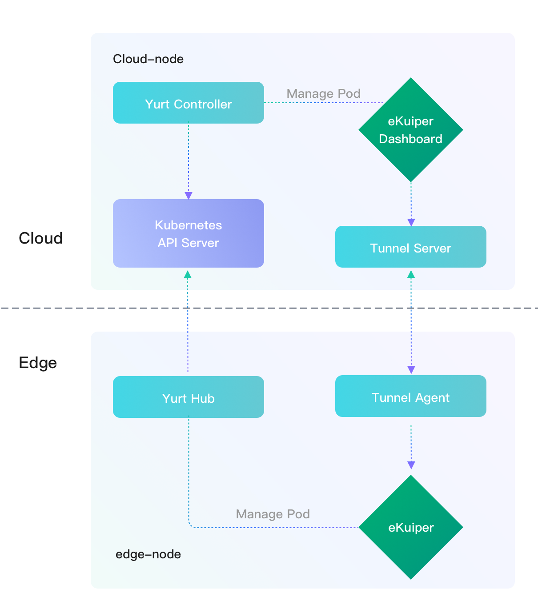
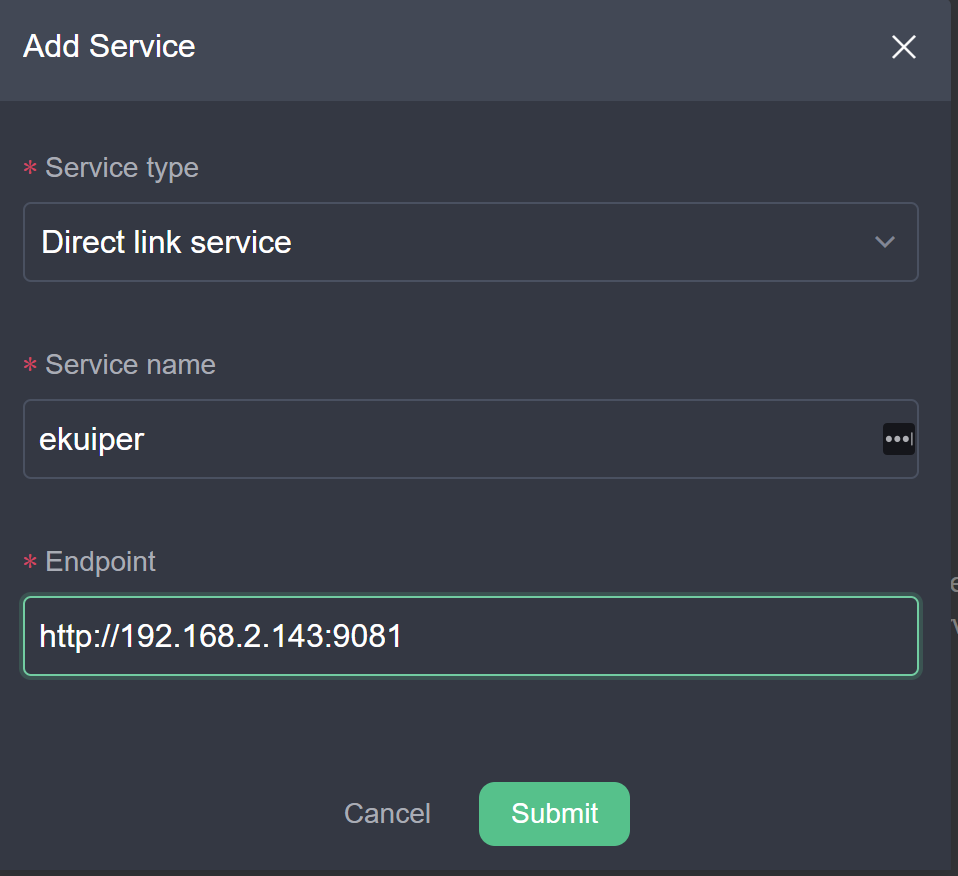
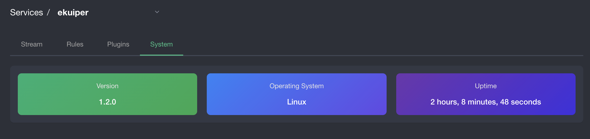

# 使用 OpenYurt 部署和管理 eKuiper

LF Edge eKuiper 是轻量级物联网数据分析和流处理软件，通常在边缘端运行。 它提供了一个 [管理仪表板](../../operation/manager-ui/overview.md) 来管理一个或多个 eKuiper 实例。
通常，仪表板部署在云节点中，用于管理跨多个边缘节点的 eKuiper 实例。

在大多数情况下，出于安全或其他考虑，边缘节点在物理上无法从云节点访问。 这使得部署变得困难，并且无法进行云到边缘管理。 [OpenYurt](https://github.com/openyurtio/openyurt) 改变了这种情况。
OpenYurt 基于原生 Kubernetes 构建，可以对其进行扩展以无缝支持边缘计算。 简而言之，OpenYurt 使用户能够管理在边缘基础设施中运行的应用程序，就像它们在云基础设施中运行一样。

在本教程中，我们将展示如何在 OpenYurt 集群中部署 eKuiper 及其仪表板，并利用 yurt 隧道实现从云到边缘的管理。 为了模拟云节点和边缘节点可能位于不同网络区域的真实场景，我们使用了一个两节点的 kubernetes 集群。 eKuiper 实例将部署到边缘节点，仪表板将部署到云节点。



## 先决条件

在本教程中，云节点和边缘节点都必须安装 kubernetes 及其依赖项。 在云节点中，需要使用 OpenYurt 和 helm 等工具来部署 eKuiper。

确保云节点具有外部 ip，以便边缘节点可以访问它。还要确保边缘节点是内部结点，以便云节点无法访问它。

### 云节点安装工作

首先，安装 kubeadm 及其依赖项，如 docker 引擎。 详情请查看 [安装 kubeadm 的官方文档](https://kubernetes.io/docs/setup/production-environment/tools/kubeadm/install-kubeadm/)。 **注意，OpenYurt 不支持高于 1.20 的 kubernetes 版本，所以请安装 1.20.x 或以下版本。** 对于类似 debian 的系统，使用如下命令安装：

```shell
sudo apt-get install -y kubelet=1.20.8-00 kubeadm=1.20.8-00 kubectl=1.20.8-00
```

接下来，[安装 Golang](https://golang.org/doc/install) ，然后[构建 OpenYurt](https://github.com/openyurtio/openyurt#getting-started)。

最后，[安装 helm](https://helm.sh/docs/intro/install/)，因为我们将通过 helm chart 部署 eKuiper。

在本教程中，云节点的主机名是 `cloud-node`。 您可以修改您的主机名以匹配此名称，或者您必须将本教程中所有出现的 `cloud-node` 替换为您的云节点主机名。

### 边缘节点安装工作

只需在边缘节点中安装 `kubeadm`。

在本教程中，边缘节点的主机名是 `edge-node`。 您可以修改您的主机名以匹配此名称，或者您必须将本教程中所有出现的 `edge-node` 替换为您的边缘节点主机名。

## 设置 Kubernetes 集群

我们将通过 `kubeadm` 配置 kubernetes 集群，并让边缘节点加入集群。

假设您的云节点的外部 IP 是 `34.209.219.149`。 在云节点中，输入以下命令，我们将得到类似下面的结果。

```shell
# sudo kubeadm init --control-plane-endpoint 34.209.219.149 --kubernetes-version stable-1.20 
[init] Using Kubernetes version: v1.20.8
...
Your Kubernetes control-plane has initialized successfully!

To start using your cluster, you need to run the following as a regular user:

  mkdir -p $HOME/.kube
  sudo cp -i /etc/kubernetes/admin.conf $HOME/.kube/config
  sudo chown $(id -u):$(id -g) $HOME/.kube/config

Alternatively, if you are the root user, you can run:

  export KUBECONFIG=/etc/kubernetes/admin.conf

You should now deploy a pod network to the cluster.
Run "kubectl apply -f [podnetwork].yaml" with one of the options listed at:
  https://kubernetes.io/docs/concepts/cluster-administration/addons/

You can now join any number of control-plane nodes by copying certificate authorities
and service account keys on each node and then running the following as root:

  kubeadm join 34.209.219.149:6443 --token i24p5i.nz1feykoggszwxpq \
    --discovery-token-ca-cert-hash sha256:3aacafdd44d1136808271ad4aafa34e5e9e3553f3b6f21f972d29b8093554325 \
    --control-plane

Then you can join any number of worker nodes by running the following on each as root:

kubeadm join 34.209.219.149:6443 --token i24p5i.nz1feykoggszwxpq \
    --discovery-token-ca-cert-hash sha256:3aacafdd44d1136808271ad4aafa34e5e9e3553f3b6f21f972d29b8093554325
```

通过命令，我们指定外部 ip 作为控制平面端点，以便边缘节点可以访问，并将 kubernetes 版本指定为 1.20，这是 OpenYurt 中支持的最新版本。

按照输出中的说明设置 kubeconfig。 然后复制要在边缘节点中使用的 `kubeadm join` 命令。

**在边缘节点**，运行复制的命令：

```shell
sudo kubeadm join 34.209.219.149:6443 --token i24p5i.nz1feykoggszwxpq \
    --discovery-token-ca-cert-hash sha256:3aacafdd44d1136808271ad4aafa34e5e9e3553f3b6f21f972d29b8093554325
```

如果一切顺利，返回云节点并输入以下命令以获取 k8s 节点列表，确保您可以获得 2 个节点：

```shell
$ kubectl get nodes -o wide
NAME         STATUS     ROLES                  AGE   VERSION   INTERNAL-IP     EXTERNAL-IP   OS-IMAGE             KERNEL-VERSION     CONTAINER-RUNTIME
cloud-node   NotReady   control-plane,master   17m   v1.20.8   172.31.6.118    <none>        Ubuntu 20.04.2 LTS   5.4.0-1045-aws     docker://20.10.7
edge-node    NotReady   <none>                 17s   v1.20.8   192.168.2.143   <none>        Ubuntu 20.04.2 LTS   5.4.0-77-generic   docker://20.10.7
```

如果节点状态为 'NotReady'，则可能是未配置容器网络。 我们可以按照 [此处](https://kubernetes.io/docs/concepts/cluster-administration/addons/) 的描述安装 kubernetes 网络插件。 例如，安装 Weave Net 插件：

```shell
$ kubectl apply -f "https://cloud.weave.works/k8s/net?k8s-version=$(kubectl version | base64 |
tr -d '\n')"
```

几分钟后，运行 `kubectl get nodes -o wide`，节点应该已准备就绪。

至此，我们已经创建了一个具有两个节点的 k8s 集群：cloud-node 和 edge-node。

### 使云节点可访问

在 `kubectl get nodes -o wide` 返回的结果中，如果 cloud-node 的内部 IP 不是可访问的外部 IP，我们需要使其可访问。 您可以为节点指定外部 IP。 但是，在大多数像 AWS
这样的云平台，机器没有外部IP，我们需要添加 iptables 规则，将内部 IP 的访问转化到外部 IP。 假设云节点的内部 IP 为 `172.31.0.236`，在云节点中添加 iptables 规则。

```shell
$ sudo iptables -t nat -A OUTPUT -d 172.31.0.236 -j DNAT --to-destination 34.209.219.149
```

在边缘节点中添加另一个 iptables 规则。

```shell
$ sudo iptables -t nat -A OUTPUT -d 172.31.0.236 -j DNAT --to-destination 34.209.219.149
```

通过运行 `ping 172.31.0.236`，确保在边缘节点中可以访问 `172.31.0.236` 。

## 将 eKuiper 实例部署到边缘

eKuiper 作为边缘流处理软件，通常部署在边缘端。 我们将使用 eKuiper helm chart 来加速部署。

```shell
$ git clone https://github.com/lf-edge/ekuiper
$ cd ekuiper/deploy/chart/Kuiper
```

为了将 eKuiper 部署到 edge-node，我们将修改 helm chart 中的模板文件。
编辑 `template/StatefulSet.yaml` 第 38 行以添加 nodeName 和 hostNetwork，如下所示。 其中， `edge-node` 是边缘节点的主机名字，如果您的主机名不同，请更改以匹配您的边缘主机名。

```yaml
...
spec:
   nodeName: edge-node
   hostNetwork: true
   volumes:
        {{- if not .Values.persistence.enabled }}
...
```

保存更改并通过 helm 命令部署 eKuiper：

```shell
$ helm install ekuiper .
```

您将运行两个新服务。

```shell
$ kubectl get services
NAME               TYPE        CLUSTER-IP       EXTERNAL-IP   PORT(S)              AGE
ekuiper            ClusterIP   10.99.57.211     <none>        9081/TCP,20498/TCP   22h
ekuiper-headless   ClusterIP   None             <none>        <none>               22h
```

通过验证 pod，ekuiper 应该在 `edge-node` 中运行。

```shell
$ kubectl get pods -o wide
NAME                        READY   STATUS    RESTARTS   AGE   IP           NODE           NOMINATED NODE   READINESS GATES
ekuiper-0                   1/1     Running   0          22h   10.244.1.3   edge-node   <none>           <none>
```

`ekuiper` rest 服务在集群内运行，端口为 9081。我们可以通过在边缘节点中键入以下命令来检查服务连接，其中 `192.168.2.143` 是边缘节点内网 ip。

```shell
$ curl http://192.168.2.143:9081
{"version":"1.2.0","os":"linux","upTimeSeconds":81317}
```

## 将 eKuiper 仪表板部署到云端

我们将使用 [kmanager.yaml](./kmanager.yaml) 和 kubectl 工具在云节点中部署 ekuiper 仪表板。 eKuiper manager 是一个基于 web
的用户界面。在配置文件中，我们为eKuiper manager 定义了部署和服务。

首先，我们需要确保文件中使用的仪表盘版本跟 eKuiper 版本相匹配。打开并修改 kmanager.yaml 第21行，确保版本正确。

```yaml
...
containers:
   - name: kmanager
     image: emqx/ekuiper-manager:1.3.1
...
```

然后，运行 kubectl 命令

```shell
$ kubectl apply -f kmanager.yaml
```

运行 get 服务，你将得到如下结果：

```shell
$kubectl get svc
NAME               TYPE        CLUSTER-IP      EXTERNAL-IP   PORT(S)              AGE
ekuiper            ClusterIP   10.99.57.211    <none>        9081/TCP,20498/TCP   120m
ekuiper-headless   ClusterIP   None            <none>        <none>               120m
kmanager-http      NodePort    10.99.154.153   <none>        9082:32555/TCP       15s
kubernetes         ClusterIP   10.96.0.1       <none>        443/TCP              33h
```

仪表板在端口 `32555` 的云节点中运行。 因此，在浏览器中使用 url http://34.209.219.149:32555 打开仪表板。 使用默认用户名和密码登录：admin/public 。

我们的目标是在边缘节点管理 eKuiper 实例。 因此，我们将在上一节中设置的边缘节点中添加一个 eKuiper 服务作为仪表板中的服务。

1. 创建 `Add Service` 并填写如下表格。

   

2. 服务创建完成后，点击服务名称 `ekuiper` 并切换到 `system`  页面。 连接应该被断开，这样我们就会得到关于连接的错误信息。 那是因为 `http://192.168.2.143:9081/` 是边缘端 eKuiper 服务的内网地址， 不能直接从云端访问。

在下一节中，我们将设置 yurt 隧道，让仪表板管理 edge 端的 eKuiper 实例。

## 设置 yurt 隧道

我们将使用 OpenYurt 将隧道设置为云和边缘节点之间的通信管道。 因为我们需要连接到边缘的 `9081` 端口，我们必须在 yurt 隧道中设置端口映射。

在云节点中，打开 `openyurt/config/setup/yurt-tunnel-server.yaml` 文件，编辑 configmap 第31行  `yurt-tunnel-server-cfg`，添加 nat-ports-pair，如下所示。

```yaml
apiVersion: v1
kind: ConfigMap
metadata:
  name: yurt-tunnel-server-cfg
  namespace: kube-system
data:
  dnat-ports-pair: "9081=10264"
```

然后编辑第 175 行以添加 cloud-node 外部 ip 作为证书 ip。 仅当云节点没有公共 ip 和 [使用 NAT 规则设置](#使云节点可访问) 时才需要这样做。

```yaml
...
args:
  - --bind-address=$(NODE_IP)
  - --insecure-bind-address=$(NODE_IP)
  - --proxy-strategy=destHost
  - --v=2
  - --cert-ips=34.209.219.149
...
```

然后，我们将 kubernetes 集群转换为 OpenYurt 集群。

```shell
$ _output/bin/yurtctl convert --cloud-nodes cloud-node --provider kubeadm
```

接下来我们将通过分别部署 yurt-tunnel-server 和 yurt-tunnel-agent 手动设置 yurt 隧道。

在设置 yurt 隧道服务器之前，我们先给云节点添加一个标签

```shell
$ kubectl label nodes cloud-node openyurt.io/is-edge-worker=false
```

然后，我们可以部署 yurt 隧道服务器：

```shell
$ kubectl apply -f config/setup/yurt-tunnel-server.yaml
```

接下来，我们可以设置 yurt 隧道代理。 和之前一样，我们给边缘节点添加一个标签，允许在边缘节点上运行 yurt 隧道代理：

```shell
kubectl label nodes edge-node openyurt.io/is-edge-worker=true
```

并且，应用 yurt-tunnel-agent. yaml文件：

```shell
kubectl apply -f config/setup/yurt-tunnel-agent.yaml
```

代理和服务器运行后，我们应该可以从仪表板管理 ekuiper。 返回浏览器中的仪表板，单击服务名称 `ekuiper` 并切换到 `system` 选项卡，我们应该会发现该服务是健康的，如下图所示：



很棒！ 现在我们可以通过仪表板在边缘管理 eKuiper，就像它部署在云端一样。参照 [manager ui教程](../../operation/manager-ui/overview.md)，可以从云端创建和管理 eKuiper
的流、规则和插件以及任何类似的管理工作。

## 扩展阅读

如果您想了解LF Edge eKuiper 或者 OpenYurt 的更多特性，请阅读下面的参考资料：

- [eKuiper Github 代码库](https://github.com/lf-edge/ekuiper/)
- [eKuiper 参考指南](https://github.com/lf-edge/ekuiper/blob/edgex/docs/en_US/reference.md)
- [OpenYurt 教程](https://github.com/openyurtio/openyurt/tree/master/docs/tutorial)
- [eKuiper 管理控制台教程](../../operation/manager-ui/overview.md)