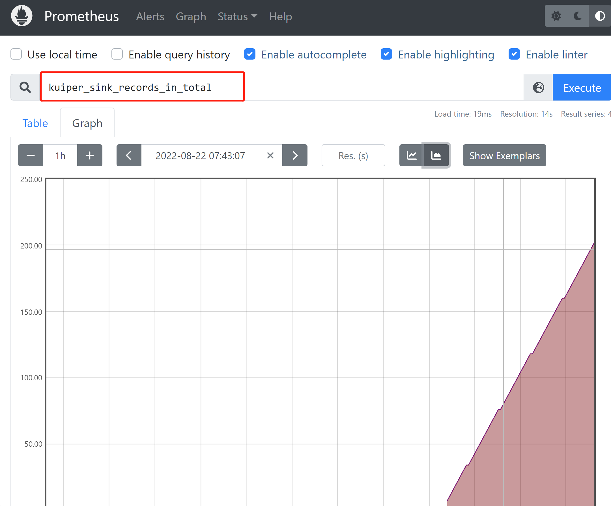

# 使用 Prometheus 监控规则运行状态

Prometheus 是一个托管于 CNCF 的开源系统监控和警报工具包，许多公司和组织都采用了 Prometheus 作为监控告警工具。

eKuiper 的规则是一个持续运行的流式计算任务。规则用于处理无界的数据流，正常情况下，规则启动后会一直运行，不断产生运行状态数据。直到规则被手动停止或出现不可恢复的错误后停止。eKuiper 中的规则提供了状态 API，可获取规则的运行指标。同时，eKuiper 整合了 Prometheus，可方便地通过后者监控各种状态指标。本教程面向已经初步了解 eKuiper 的用户，将介绍规则状态指标以及如何通过 Prometheus 监控特定的指标。

## 规则状态指标

使用 eKuiper 创建规则并运行成功后，用户可以通过 CLI，REST API 或者管理控制台查看规则的运行状态指标。例如，已有规则 rule1，可通过 `curl -X GET "http://127.0.0.1:9081/rules/rule1/status"` 获取 JSON 格式的规则运行指标，如下所示：

```json
{
  "status": "running",
  "source_demo_0_records_in_total": 265,
  "source_demo_0_records_out_total": 265,
  "source_demo_0_process_latency_us": 0,
  "source_demo_0_buffer_length": 0,
  "source_demo_0_last_invocation": "2022-08-22T17:19:10.979128",
  "source_demo_0_exceptions_total": 0,
  "source_demo_0_last_exception": "",
  "source_demo_0_last_exception_time": 0,
  "op_2_project_0_records_in_total": 265,
  "op_2_project_0_records_out_total": 265,
  "op_2_project_0_process_latency_us": 0,
  "op_2_project_0_buffer_length": 0,
  "op_2_project_0_last_invocation": "2022-08-22T17:19:10.979128",
  "op_2_project_0_exceptions_total": 0,
  "op_2_project_0_last_exception": "",
  "op_2_project_0_last_exception_time": 0,
  "sink_mqtt_0_0_records_in_total": 265,
  "sink_mqtt_0_0_records_out_total": 265,
  "sink_mqtt_0_0_process_latency_us": 0,
  "sink_mqtt_0_0_buffer_length": 0,
  "sink_mqtt_0_0_last_invocation": "2022-08-22T17:19:10.979128",
  "sink_mqtt_0_0_exceptions_total": 0,
  "sink_mqtt_0_0_last_exception": "",
  "sink_mqtt_0_0_last_exception_time": 0
}
```

运行指标主要包括两个部分，一部分是 status，用于标示规则是否正常运行，其值可能为 `running`, `stopped manually` 等。另一部分为规则每个算子的运行指标。规则的算子根据规则的 SQL 生成，每个规则可能会有所不同。在此例中，规则 SQL 为最简单的 `SELECT * FROM demo`, action 为 MQTT，其生成的算子为 [source_demo, op_project, sink_mqtt] 3个。每一种算子都有相同数目的运行指标，与算子名字合起来构成一条指标。例如，算子 source_demo_0 的输入数量 records_in_total 的指标为 `source_demo_0_records_in_total`。

### 运行指标

每个算子的运行指标是相同的，主要有以下几种：

- records_in_total：读入的消息总量，表示规则启动后处理了多少条消息。
- records_out_total：输出的消息总量，表示算子**正确**处理的消息数量。
- process_latency_us：最近一次处理的延时，单位为微妙。该值为瞬时值，可了解算子的处理性能。整体规则的延时一般由延时最大的算子决定。
- buffer_length：算子缓冲区长度。由于算子之间计算速度会有差异，各个算子之间都有缓冲队列。缓冲区长度较大的话说明算子处理较慢，赶不上上游处理速度。
- last_invocation：算子的最后一次运行的时间。
- exceptions_total：异常总量。算子运行中产生的非不可恢复的错误，例如连接中断，数据格式错误等均计入异常，而不会中断规则。

在 1.6.1 版本以后，我们又添加了两个异常相关指标，方便异常的调试处理。

- last_exception：最近一次的异常的错误信息。
- last_exception_time：最近一次异常的发生时间。

这些运行指标中的数值类型指标均可使用 Prometheus 进行监控。下一节我们将描述如何配置 eKuiper 中的 Prometheus 服务。

## 配置 eKuiper 的 Prometheus 服务

eKuiper 中自带 Prometheus 服务，但是默认为关闭状态。用户可修改 `etc/kuiper.yaml` 中的配置打开该服务。其中，`prometheus` 为布尔值，修改为 `true` 可打开服务；`prometheusPort` 配置服务的访问端口。

```yaml
  prometheus: true
  prometheusPort: 20499
```

若使用 Docker 启动 eKuiper，也可通过配置环境变量启用服务。

```shell
docker run -p 9081:9081 -d --name ekuiper MQTT_SOURCE__DEFAULT__SERVER="$MQTT_BROKER_ADDRESS" KUIPER__BASIC__PROMETHEUS=true lfedge/ekuiper:$tag
```

在启动的日志中，可以看到服务启动的相关信息，例如:

```text
time="2022-08-22 17:16:50" level=info msg="Serving prometheus metrics on port http://localhost:20499/metrics" file="server/prome_init.go:60"
Serving prometheus metrics on port http://localhost:20499/metrics
```

点击提示中的地址 `http://localhost:20499/metrics` ，可查看到 Prometheus 中搜集到的 eKuiper 的原始指标信息。eKuiper 有规则正常运行之后，可以在页面中搜索到类似 `kuiper_sink_records_in_total` 等的指标。用户可以配置 Prometheus 接入 eKuiper，进行更丰富的展示。

## 使用 Prometheus 查看状态

上文我们已经实现了将 eKuiper 状态输出为 Prometheus 指标的功能，接下来我们可以配置 Prometheus 接入这一部分指标，并完成初步的监控。

### 安装和配置

到 [Prometheus 官方网站](https://prometheus.io/download/) 下载所需要的系统版本然后解压。

修改配置文件，使其监控 eKuiper。打开 `prometheus.yml`，修改 scrape_configs 部分，如下所示：

```yaml
global:
  scrape_interval:     15s
  evaluation_interval: 15s

rule_files:
  # - "first.rules"
  # - "second.rules"

scrape_configs:
  - job_name: ekuiper
    static_configs:
      - targets: ['localhost:20499']
```

此处定义了监控任务名为 `eKuiper`, targets 指向上一节启动的服务的地址。配置完成后，启动 Prometheus 。

```shell
./prometheus --config.file=prometheus.yml
```

启动成功后，打开 `http://localhost:9090/` 可进入管理控制台。

### 简单监控

监控所有规则的 sink 接收到的消息数目变化。可以在如图的搜索框中输入需要监控的指标名称，点击 `Execute` 即可生成监控表。选择 `Graph` 可切换为折线图等展示方式。



点击 `Add Panel`，通过同样的配置方式，可监控更多的指标。

## 总结

本文介绍了 eKuiper 中的规则状态指标以及如何使用 Prometheus 简单地监控这些状态指标。用户朋友可以基于此进一步探索 Prometheus 的更多高级功能，更好地实现 eKuiper 的运维。


