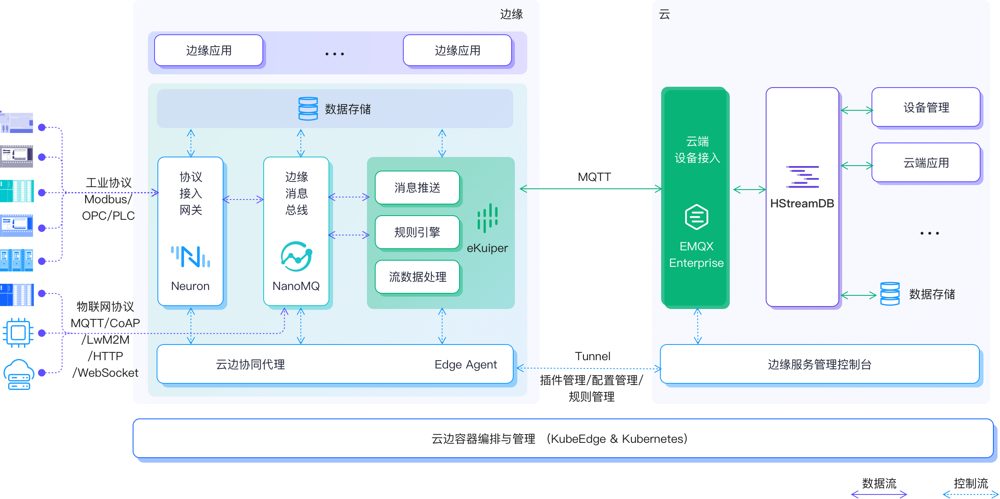
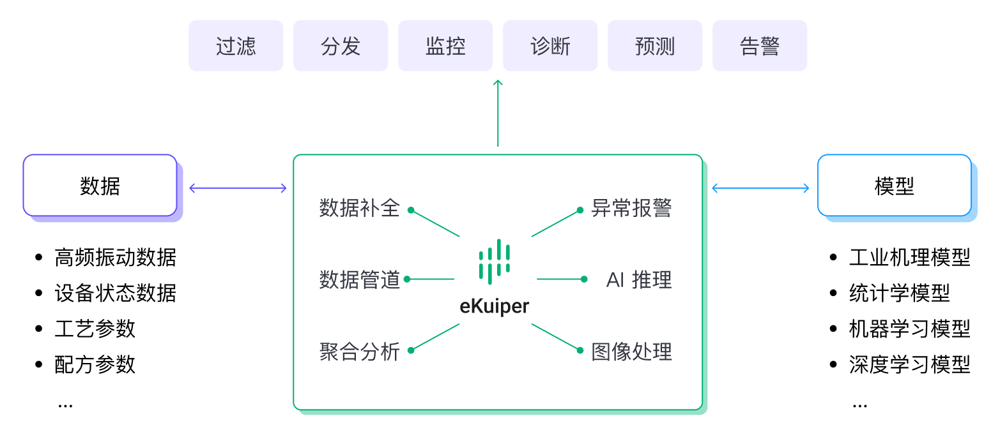

# eKuiper 在 IIoT（工业物联网）的应用

在全球工业转型的新浪潮中，智能制造获得了巨大的发展机遇。得益于云计算、大数据和人工智能技术，工业转型升级进入新阶段，人们逐渐意识到数据驱动的新商业模式所带来的巨大价值。数据与算法模型的结合与碰撞，为复杂系统的不确定性解决、洞察力发现和企业决策提供了强大的数据支持和新的引擎动能。

作为一个轻量级的流处理引擎，eKuiper 可以部署在靠近数据源的边缘侧，做实时分析和智能决策。

## 云边缘协作工业互联网解决方案

EMQ云边缘协同工业互联网解决方案，通过云原生技术和云边缘协同架构，实现了海量工业设备数据的连接、移动、处理、存储和分析。该方案主要包括以下软件。

| 软件            | 名称                                               |
|---------------|--------------------------------------------------|
| 边缘数据采集软件      | [Neuron](https://neugates.io/) - 工业协议网关软件        |
| 边缘MQTT Broker | [NanoMQ](https://nanomq.io/) - 超轻量级边缘 MQTT 消息服务器 |
| 边缘计算软件        | eKuiper - 轻量级物联网边缘数据流分析引擎                        |
| 边缘服务管理平台      | EMQX Antares - 云原生边缘服务管理平台                       |

其中，eKuiper在边缘和云的中间位置发挥作用。它可以消费收集到的数据，对其进行处理，并将结果进行路由。

## 边缘计算场景

通过对收集到的数据进行实时分析，eKuiper 可以应用于常见的工业场景，如能源消耗监测、预测性维护和产品质量追溯。典型的应用场景包括。

- 对工厂生产数据进行实时分析，有效控制产品质量
- 设备影子，数据清理、转换和压缩
- 异常感应、报警和处理
- 由人工智能增强的生产过程优化

让我们以最后一个场景为例。

### 生产过程优化

无论是流程工业还是离散工业，生产过程的优化和稳定控制都是企业降低运营成本、提高生产效率、打造核心竞争力的前提条件。在工业4.0时代智能转型的背景下，充分利用海量数据的价值，实现流程优化和现场稳控，是企业不断思考和探索的命题，也是企业共同的需求。

例如，在钢铁行业，加热炉是轧钢过程中的重要设备。通过实时采集加热炉数据，结合先进的控制优化算法，可以保证炉温稳定，在节约煤气成本的基础上提高钢坯质量。

在化工行业，企业主要关注的是原料性能的变化和生产负荷的调整。目前的检测方法多为人工定期取样和离线送检，普遍存在耗时长、环节多等问题，难以实现生产的有效反馈和优化控制。利用实时数据建模分析，可以实现对反应过程的准确把握，实时干预，减少因干预不及时造成的原料浪费。

在智能工厂场景下，通过对机器数据的实时采集，结合MES系统的历史数据分析和验证，可以对机器参数值进行实时修正和迭代，可以保证机器生产过程中的人工干预减少，产品质量更加稳定。

在工业节能降耗领域，通过对能源数据全过程的采集，结合动能设备、生产自动化系统和MES系统，形成系统间的智能联动，基于生产计划，可以实现对能源需求的精细化预测，提高企业的能耗管理水平。

#### 整合多个来源的数据

eKuiper 可以为工业现场提供灵活的数据对接能力，实现工厂 MES、ERP、数据库和各种第三方应用的数据拉动和集成，通过流计算能力对数据进行清洗和处理，以流表组合能力实现工业现场人机、物法循环的互动和协同。Neuron 是一款工业协议网关软件，通过边缘消息总线将工厂内的 PLC、非标自动化设备、SCADA和各种仪器整合在一起，进行实时数据采集。同时，Neuron 通过 MQTT 和 Restful API 实现对工厂设备的反向控制，并结合控制优化算法，实现低延迟的数据处理和分析以及生产过程优化。

通过 Neuron+eKuiper 对多维数据的高效采集，可以将工厂内机器设备的实时数据、与生产经营相关的业务数据、产品设计和工艺数据以及工厂内各种生产管理软件的数据进行汇总和分析，实现生产过程优化，减少生产损耗，提高产量。

#### 边缘侧AI模型集成，实现实时推理决策

eKuiper 可以充分利用工业现场的多维数据，吸收和沉淀人工经验，结合工业机械知识和数据统计方法，利用机器学习和深度学习算法，建立设备生产过程的优化模型，优化和控制生产过程，使设备运行更加可靠和稳定，提高企业经济效益。

eKuiper 支持调用 Python 科学计算、机器学习和深度学习算法库以及从 Matlab 转移过来的 C/C++ 算法模型，结合实时数据流，在边缘实现实时 AI 推理计算，并将推理结果通过 Neuron 实时发送到自动化设备端，实现生产过程的实时优化和持续优化。

## 总结

新一代信息技术与制造业的深度融合，通过人、机、物的全面互联，构建全要素、全产业链、全价值链的新型工业生产、制造和服务体系，是支撑第四次工业革命的核心和关键。

EMQ 云边协同工业互联网解决方案，将人工智能和云计算技术与传统工业生产相连接，帮助企业实现数据流、生产流和控制流的协同，提高生产效率，降低生产成本，帮助工厂实现数字化、实时化、智能化转型。
