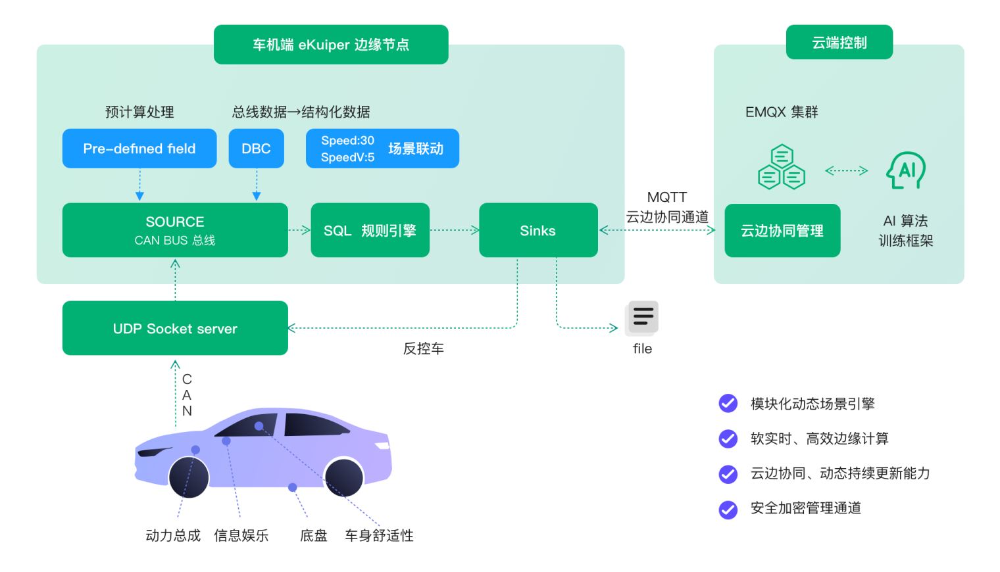

# eKuiper 在 IoV（车联网）中的应用

随着车联网和 5G 技术的融合以及车辆智能化的发展，车联网的数据采集需求呈爆发式增长。

## 架构

基于大量的车联网用户案例和经验，EMQ 推出了基于 eKuiper 和 QUIC 协议的车云系统解决方案，实现了车联网数据采集的易部署性和可移植性。其中，eKuiper是车辆方面的核心服务。该解决方案的架构如下图所示。



作为一个轻量级的流处理引擎，eKuiper 资源占用较小，内存使用在 20MB 级别即可进行数据采集处理。因此，eKuiper 适合部署到汽车的边缘侧，如 TBOX、MPU和信息娱乐系统。

在本方案中，我们使用eKuiper，在物联网边缘进行流处理，实现对车载终端的灵活数据采集；并采用[EMQX](https://www.emqx.com/en)，大规模分布式物联网 MQTT 消息服务器，实现采集数据的连接、移动和处理，以及车云一体化的控制命令交互。

## 场景

eKuiper 在车联网中最成熟的用法是实现灵活的数据采集，我们将在后面详细了解这个场景。其他场景包括。

1. 车侧实时、灵活（热部署）的规则引擎，当满足某些条件时可以自动触发行动。例如当车速高于70时，关闭所有车窗。
2. 敏捷的智能分析。在没有云端连接的情况下，本地 eKuiper 可以帮助自动连接数据和人工智能模型（目前是TF Lite），而不需要编码。同时将数据输入到车辆上的训练模型。典型的场景包括通过实时数据，如车速、轮胎压力，在本地预测和建议驾驶模式（即使没有网络连接）。
3. 边缘计算，以减少传输带宽和减少云端计算压力。解析、重新格式化和转换数据。如计算一个时间窗口的平均速度并保存。
4. 异构数据聚合。解析来自各种协议（TCP,UDP,HTTP,MQTT）和各种格式（CAN,JSON,CSV等）的数据，并通过灵活的规则将其合并。
5. 消息路由：决定哪些数据要发送到云端，哪些要保存在本地，以便被其他车辆端应用所利用。例如，基于GDPR或一些白名单来决定路由。

其中，数据收集是所有应用程序的核心。一旦收集到数据，eKuiper 就可以在车辆内部利用它，或者将它传输到云端。

## 灵活数据采集


### 为什么需要灵活数采

现有的数据采集方案往往通过车载数据采集终端（T-BOX）固件中的采集功能或自行编写的采集程序进行车辆数据采集。通常采集程序所采集到的车身信息是固定且直接固化在车载终端上的。在智能车联网时代之前，采集的数据种类少、全量采集压力不大，这种做法是可行的。

随着车联网技术的发展，车辆整车网络构成也越来越复杂，可采集的车身信息多样化，全量采集数据量过大而且浪费宝贵的带宽资源，因此需要根据 TSP 应用的需求按需进行采集。此外，不同车型的汽车通常会有不同的数据，例如 CAN 总线的数据在不同车型上会有不同的 DBC 文件*。固定采集程序无法移植，必须重新编写，并 OTA 升级采集程序。

总的来讲，固定采集程序存在以下问题：

采集的数据固定，无法灵活变更采集的项目。实际上随着车联网的发展，数据采集项目将根据应用呈现更多变化，固定的采集方式无法满足经常变动的真实需求。

采集信息解析配置固定，无法匹配新的车型或总线数据变化。例如，采集 CAN 总线数据的采集程序，无法变更 DBC 文件以匹配总线数据的变化。

扩展不易，新的传感器或总线协议需要重新开发。

因此，业界迫切需要一种灵活的、支持弱网情况的数据采集方案。

注：DBC（Data Base CAN）文件是由德国 Victor 公司发布的，它被用来描述单一 CAN 网络中各逻辑节点信息，依据该文件可以开发出监视和分析 CAN 网络中所有逻辑节点的运行状态。

### 如何实现灵活数采

针对固定数采程序缺陷，我们需要一个灵活数据采集引擎，并具备以下能力：

- 灵活数据埋点配置和规则，并可热更新和热启停数据采集规则。
- 多数据源对接和解析能力，例如 CAN 总线、HTTP 信号等。
- 灵活配置数据源解析的能力。以 CAN 总线为例，应当支持 DBC 文件的灵活加载和更新。
- 采集数据灵活分发的能力。可根据业务创建规则，将一部分数据本地保存，一部分数据回传云端。
- 弱网工况下，采集数据高效回传的能力。
- 足够轻量高效，从而可以运行在多种车型，包括车机资源受限的车型上。

在灵活数采的场景中，假设 eKuiper 已部署到车机中，要完成一个数采任务，一般只需要两个步骤：

1. 接入数据流
2. 建立采集规则

在 eKuiper 中，这两个步骤无需编写代码，可使用 SQL 语句或者可视化 Flow 编辑器进行配置。

### 数据流接入

CAN（Controller Area Network）是最常见的车联网总线网络。本文以接入和解析 CAN 数据为例，介绍 eKuiper 如何实现车载数据流的接入。

在 eKuiper 中可实现 CAN 数据源，其中主要实现了两个能力：

- 连接协议
- 根据 DBC 解码 CAN 报文

### 连接协议支持

若 eKuiper 可以通过 [SocketCAN](https://docs.kernel.org/networking/can.html) 协议直接连接 CAN 总线，则可建立到车载总线的连接，获取总线数据。出于安全的原因，eKuiper 也经常被部署到与总线隔离的硬件上。例如，eKuiper 部署在 MPU 中；而在 MCU 中部署 CAN 总线连接应用，通过 TCP、UDP 或者 MQTT 协议等，将报文透传出来。eKuiper 同样支持通过这些协议进行连接，获取总线数据报文。


### 灵活 CAN 报文解码

我们从总线接收到的报文为二进制编码的数据，人类难以阅读。CAN DBC 是一种文本文件，用于 CAN 报文的描述文件。通过读取 DBC 的描述信息，我们可以把 CAN 报文的数据解析为物理值的信息。例如，一段 CAN ID 0x208 的数据 0x0500000000000000，根据 DBC 的描述信息可能解析为一系列信号，可表示为键值对或者 JSON 串 {"temperature":10, "voltage": 100} 等。

eKuiper 的 CAN 数据源可将数据解析为可读的键值对，这样编写数据采集规则的时候，可以直接选取可读的信号，大大简化采集逻辑的编写。CAN 报文解析功能具有极大的灵活性，可以动态地更新 DBC 文件以适配不同的车型或升级车载总线数据而无需编码。

CAN 报文解析的灵活性主要体现在如下方面：

- DBC 文件可配置，可热更新
- 支持多个 DBC 文件
- 支持 CAN FD 格式
- 支持白名单和 container ID 映射

基于灵活的报文解码支持，当总线数据结构改变或者更改车型时，仅需更新 DBC 文件即可适配。

在 eKuiper 中，流（stream）是用于定义数据接入的一个实体。我们可使用如下的 SQL 语句，定义一个接入 CAN 总线的数据流。

```sql
CREATE STREAM canDemo () WITH ( Type="can", CONF_KEY="test", SHARED="TRUE")
```

该语句定义了一个名为 canDemo 的流，其类型为 `can`，即接入 CAN 总线的数据源类型；CONF_KEY 表示接入配置定义在名为 test 的配置中，其中可配置使用的 DBC 文件地址等；SHARED 设置为 true，表示使用该数据流的所有规则共享一份数据，确保解码只会进行一次。

该流将接入解析 CAN 总线数据，得到 JSON 数据流。接下来，应用开发人员可以在其上创建多条规则，定义如何采集数据。

#### 接入扩展

随着汽车智能化程度的提高，车载的传感器和数据总线的数量和种类越来越多。eKuiper 提供了扩展机制，用户可以编写插件实现新的协议或私有协议的接入和解析。安装后的插件遵循使用逻辑，应用开发人员可以与使用原有的数据流类型相同的方法创建数据流。

### 灵活配置采集规则

前文中我们已经创建了连接 CAN 总线的数据流，接下来我们可以建立多个数据采集规则进行灵活的数采。本节介绍一些常见的采集规则。规则内容为 JSON 文本数据，可通过 REST API 等方式进行规则的动态下发管理，具体管理方法将在下一节介绍。

eKuiper 的规则分为两个部分，其中 SQL 用于编写业务逻辑，例如需要采集哪些数据、对数据做哪些处理；Actions 部分用于描述规则命中后执行的动作，例如存储到本地文件或者发送到云端 MQTT 的某个主题中。假设上一节创建的数据流 canDemo 中，总线中的数据解析为包含发动机相关数据如发动机转速（rpm）、进气温度（inletTemperature）、进气压力（inletPressure）以及电池相关数据，如电池电压（voltage），电池电流（current）等数据的键值对数据，如`{"rpm":2000, "inletTemperature":230, "inletPressure":27, "voltage":15,"currency":2}`。下列配置的规则将针对这个总线数据进行采集。

1. 采集指定的信号。本规则可实时采集发动机的信号并发送到 MQTT topic collect 中。规则通过 SQL 语句中的 SELECT 子句定义了需要采集的数据点。

    ```json
    {
        "id": "ruleCollect",
        "sql": "SELECT rpm, inletTemperature, inletPressure FROM canDemo",
        "actions": [{
          "mqtt": {
            "server": "tcp://yourserver:1883",
            "topic": "collect"
          }
        }]
    }
    ```

2. 采集有变化的信号。某些信号可能变化周期比较长，全部采集的话大部分为重复值，占据存储和带宽。eKuiper 提供了内置的变化采集函数CHANGED_COLS，可以仅采集信号数值变化的情况。下面的示例规则中，我们采集了电池的变化信息，并保存在本地文件中。
    ```json
    {
      "id": "ruleChangeCollect",
      "sql": "SELECT CHANGED_COLS(\"\", true, voltage, currency) FROM canDemo",
      "actions": [{
        "file": {
        "path": "/tmp/cell"
        }
      }]
    }
    ```
3. 根据事件采集。某些信号只有在特定的情况下才需要采集，例如碰撞后采集相关的数据。eKuiper 中可以灵活设置采集的条件。以下的规则中，当电池电压异常（不在10到20之间）的情况下，采集所有数据到 MQTT 的 Topic exception 中。
    ```json
    {
        "id": "ruleExpCollect",
        "sql": "SELECT * FROM canDemo WHERE voltage NOT BETWEEN 10 AND 20 ",
        "actions": [{
          "mqtt": {
              "server": "tcp://yourserver:1883",
              "topic": "exception"
          }
        }]
    }
    ```


### 车云一体规则管理

规则构思完成后，需要进行动态下发和管理。EMQ 提供了车云一体的规则管理控制台，用户可以在里面进行规则的编写、下发和状态管理。管理控制台可以在云端集中管理多个车机边缘节点。

#### 规则编写

管理控制台上提供了规则编写的图形界面。如下图所示，用户可以在界面上填入规则的 ID、SQL 和动作等。提交后，规则即可下发到对应车机节点。


我们也将提供规则编写的可视化 Flow 编辑器界面。用户可采用拖拽的方式编写自己的业务规则。

#### 规则管理

eKuiper 中的规则都是可灵活管理的。规则可以热添加、热更新和热启停。在管理控制台中，用户可以查看规则的运行状态，进行规则的修改、启停、删除等操作。


#### 云端集中管理

通过云端可集中管理在车辆边缘端上的数据分析应用。

- 大规模在线车辆支持：基于 EMQX Enterprise，百万级别在线车辆支持
- 车辆在线自动更新应用：支持离线车辆应用更新、升级；车辆在线后自动更新应用，并报告状态
- 车辆离线后状态查询支持：车辆离线状态下可获取应用部署的最后状态
- HTTP Rest API 服务接口支持：同步 HTTP 接口，接入前端应用 (web & mobile)

## 更多可能

eKuiper 作为一个通用的流式计算引擎，除了实现数据采集之外，还可以实现很多边缘计算功能，充分利用车载终端算力。例如，eKuiper 可支持下列功能：

- 数据变换和格式化，例如将传输信号由整型转换回浮点型，或者将信号格式化为目标系统要求的格式。
- 数据分析，例如计算一段时间内的平均值等统计值。
- SOA 服务调用，实现场景联动，例如根据车内温度自动开关空调。
- AI/ML 算法集成，例如根据采集到的信号识别用户的充电意图等。

更多功能欢迎读者们自行探索。

## 总结

车联网软硬件技术大发展的浪潮下，传统的固定数据采集方案难以应对层出不穷的采集需求。通过本文介绍的基于 eKuiper 与 EMQX 的车云系统方案，可实现端到端的灵活数据采集需求。eKuiper 采用基于文本型业务处理应用下发，避免复杂 OTA 升级，帮助车联网企业实现灵活的数据采集以及高效的车云数据协同。