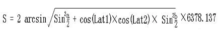
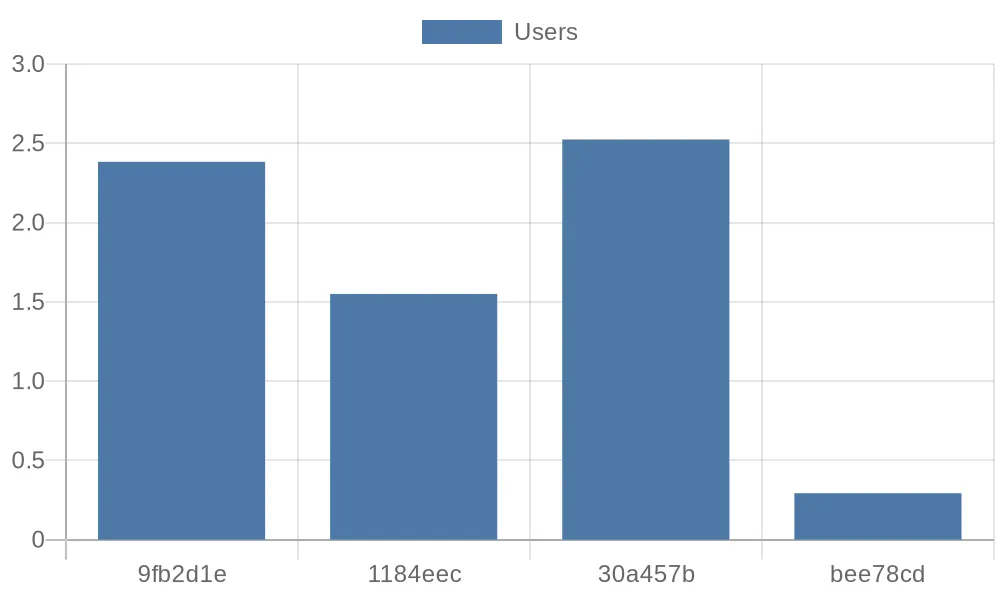

# eKuiper 在公共数据分析中的应用

在大数据时代下，有许多随处可见的公共数据分享平台，借助专业的处理技术，我们可以从中清晰地抽取有价值的信息。然而，处理和分析这些公共数据通常需要具备一定的编程技巧，这对非技术类用户来说，无疑增加了一定的学习难度。在本文中，我们将以 eKuiper 为例，展示如何通过基础的 SQL 语句轻松处理公共数据。

## 场景介绍

本教程展示了如何使用 eKuiper 处理深圳市开放数据平台的共享单车企业每日订单表数据，实现步骤包括：

- 使用 [HTTP 提取源](../guide/sources/builtin/http_pull.md)订阅开放数据平台的 API
- 使用 eKuiper 的 REST API 接口创建流和规则
- 使用内置 SQL 函数以及规则流水线对数据进行处理
- 存储处理完的数据，并通过外部 API 进行数据可视化

## 获取数据

eKuiper 支持处理毫秒级的实时数据。本教程中，我们将以日更的深圳市开放数据平台的[共享单车企业每日订单表](https://opendata.sz.gov.cn/data/api/toApiDetails/29200_00403627)的数据为例，
介绍如何使用 eKuiper 来获取相应的接口数据并进行数据处理。

> 如您希望分析实时更新的 API，可将 [HTTP 提取源](../guide/sources/builtin/http_pull.md)的 interval 调小。

数据接口的 URL 以及参数如下：

```text
http://opendata.sz.gov.cn/api/29200_00403627/1/service.xhtml?page=1&rows=100&appKey=
```

我们现在尝试使用 eKuiper 的 [HTTP 提取源](../guide/sources/builtin/http_pull.md) 从数据平台的 HTTP 服务器提取前 100 条消息数据并输入 eKuiper 处理管道。

HTTP 提取源的配置文件位于 `etc/sources/httppull.yaml` 中，我们需要配置相应的字段以便 eKuiper 能正确地拉取数据。以下是配置文件内容：

```yaml
default:
  url: "https://opendata.sz.gov.cn/api/29200_00403627/1/service.xhtml?page=1&rows=2&appKey=<token>"
  method: get
  interval: 3600000
  timeout: 5000
  incremental: false
  body: ""
  bodyType: json
  insecureSkipVerify: true
  headers:
    Accept: application/json
  responseType: code
```

随后使用 REST 客户端，创建相应的 STREAM 流来作为源输入：

```http request
###
POST http://{{host}}/streams
Content-Type: application/json

{
  "sql": "CREATE STREAM pubdata(data array(struct(START_TIME string, START_LAT string, END_TIME string, END_LNG string, USER_ID string, START_LNG string, END_LAT string, COM_ID string))) WITH (TYPE=\"httppull\")"
}
```

## 数据处理

观察接口返回的数据，发现所需的数据都在 `data` 字段的数组里：

```json
{
  "total": 223838214,
  "data": [
    {
      "START_TIME": "2021-01-30 13:19:32",
      "START_LAT": "22.6364092900",
      "END_TIME": "2021-01-30 13:23:18",
      "END_LNG": "114.0155348300",
      "USER_ID": "9fb2d1ec6142ace4d7405b**********",
      "START_LNG": "114.0133088800",
      "END_LAT": "22.6320290800",
      "COM_ID": "0755**"
    }
  ]
}
```

如果想对每一个数据使用 `SELECT` 进行计算处理，我们需要用到 [`UNNEST`](../sqls/functions/multi_row_functions.md#unnest) 来将数组中的数据作为多行返回。

```http request
###
POST http://{{host}}/rules
Content-Type: application/json

{
  "id": "demo_rule_1",
  "sql": "SELECT unnest(data) FROM pubdata",
  "actions": [{
    "log": {
    }
  }]
}
```

### 创建规则流水线

我们可以使用[内存源](../guide/sources/builtin/memory.md)来将先前规则的结果导入后续规则来形成规则管道，以便处理上一规则所产生的数据。

第一步只需要将 `demo_rule_1` 的 `actions` 字段中，再加入一个新的内存目标/源：

```json
{
  "id": "demo_rule_1",
  "sql": "SELECT unnest(data) FROM pubdata",
  "actions": [
    {
      "log": {},
      "memory": {
        "topic": "channel/data"
      }
    }
  ]
}
```

然后利用 API 基于上述内存源创建新的流：

```http request
###
POST http://{{host}}/streams
Content-Type: application/json

{"sql" : "create stream pubdata2 () WITH (DATASOURCE=\"channel/data\", FORMAT=\"JSON\", TYPE=\"memory\")"}
```

之后再创建新的规则处理源数据即可：

```http request
###
POST http://{{host}}/rules/
Content-Type: application/json

{
  "id": "demo_rule_2",
  "sql": "SELECT * FROM pubdata2",
  "actions": [{
    "log": {
    }
  }]
}
```

### SQL 计算骑行距离

eKuiper 内置了丰富的 SQL 函数，即便在不是用插件拓展的情况下，也可以利用现有函数来满足大部分场景下的计算需求。

我们的数据中已经有了单车的起始和结束坐标，所以我们可以根据经纬度计算距离公式，来计算出单车的平均速度：



其中：

- Lng1 Lat1 表示 A 点经纬度， Lng2 Lat2 表示 B 点经纬度
- `a = Lat1 – Lat2` 为两点纬度之差，`b = Lng1 -Lng2` 为两点经度之差
- 6378.137 为地球半径，单位为千米
- 计算出来的结果单位为千米，若将半径改为米为单位则计算的结果单位为米
- 计算精度与谷歌地图的距离精度类似，相差范围在 0.2 米以下

于是我们可以利用如下 SELECT 语句，计算出相应的路程以及时间：

```sql
SELECT
    6378.138 * 2 * ASIN(
        SQRT(
            POW(
                SIN((cast(START_LAT,"float") * PI() / 180 - cast(END_LAT,"float") * PI() / 180) / 2), 2) +
                COS(cast(START_LAT,"float") * PI() / 180) * COS(cast(END_LAT,"float") * PI() / 180) *
            POW(
                SIN((cast(START_LNG,"float") * PI() / 180 - cast(END_LNG,"float") * PI() / 180) / 2), 2))) *1000
        AS distance,
    (to_seconds(END_TIME) - to_seconds(START_TIME))
        AS duration
FROM pubdata2
```

### 计算骑行速度

有了距离和时间之后，我们可以继续使用规则流水线，在下一个规则中，计算所需要的单车的速度：

我们将以上一步中 SELECT 计算出来的距离与时间，继续通过内存源创建新的流，然后创建相对应的流作为下一步处理：

```http request
###
POST http://{{host}}/streams
Content-Type: application/json

{"sql" : "create stream pubdata3 () WITH (DATASOURCE=\"channel/data2\", FORMAT=\"JSON\", TYPE=\"memory\")"}
```

现在我们就可以轻松地计算出所需要的单车速度了：

```http request
###
PUT http://{{host}}/rules/demo_rule_3
Content-Type: application/json

{
  "id": "demo_rule_3",
  "sql": "SELECT (distance / duration) AS velocity FROM pubdata3",
  "actions": [{
    "log": {
    }
  }]
}
```

在 eKuiper 的日志中，我们可以看到这样类似的计算结果：

```text
2023-07-14 14:51:09 time="2023-07-14 06:51:09" level=info msg="sink result for rule demo_rule_3: [{\"velocity\":2.52405571799467}]" file="sink/log_sink.go:32" rule=demo_rule_3
```

其中的 `velocity` 就是我们所需要的单车速度。

## 可视化数据

最后，我们可以将计算数据存储在相应的 DB 中，并通过外部的 API 进行可视化展示。

```json
{
  "influx2": {
    "addr": "http://influx.db:8086",
    "token": "token",
    "org": "admin",
    "measurement": "test",
    "bucket": "pubdata",
    "tagKey": "tagKey",
    "tagValue": "tagValue",
    "fields": ["velocity", "user_id"]
  }
}
```

例如，用户可以通过 Python 脚本方便地从 InfluxDB 中获取想要的数据并做进一步处理。
以下脚本将从 DB 中获得前四条记录，并将其用 [quickchart.io](https://quickchart.io/) 的参数格式打印出来：

```python
from influxdb_client import InfluxDBClient, Point, WritePrecision
from influxdb_client.client.write_api import SYNCHRONOUS

url = "http://influx.db:8086"
token = "token"
org = "admin"
bucket = "pubdata"

client = InfluxDBClient(url=url, token=token)
client.switch_database(bucket=bucket, org=org)

query = f'from(bucket: "{bucket}") |> range(start: 0, stop: now()) |> filter(fn: (r) => r._measurement == "test") |> limit(n: 4)'

result = client.query_api().query(query)

params = '''{
  type: 'bar',
  data: {
    labels: {[v[:7] for v in record.values['user_id']]},
    datasets: [{
      label: 'Users',
      data: {record.values['velocity']}
    }]
  }
}'''

print(params)

client.close()
```

之后，我们可以将前四位的用户骑行的平均速度的参数用 [quickchart.io](https://quickchart.io/) 的柱状图接口进行可视化：


