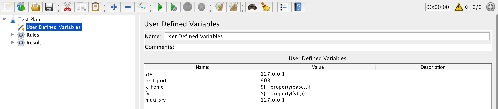

## Overview

Kuiper FVT (functional verification tests)  covers following scenarios. 

- Basic functions of HTTP REST-API 
- Basic functions of CLI
- Complex end-2-end scenario for Kuiper source, processing and sink

The scenarios will be invoked automatically in Github actions with any new code commit or push request. Another Raspberry Pi continouly integration environment will also be ready for running test cases in ARM environment. So if receives any failed FVT running, please re-check the code or update the scripts if necessary.

Kuiper project uses JMeter for writing the scripts for following reasons,

- Easy to write testcases for HTTP REST-API & CLI
- Capabilities of publish and subscribe MQTT message. The Kuiper end-2-end scenarios requires MQTT client for pub/sub message, and JMeter provides a unified approach for supporting such functions
- Capabilities of writing complex content assertions. Besides some simple ways of content assertions, JMeter also provides ``BeanShell Assertion``, which can be used for extract and process complex message contents. 

## Run script in local development environment

**Prepare JMeter**

Kuiper uses JMeter for FVT test scenarios, includes REST-API, CLI and end to end test scenarios. 

- Install JRE - requires JRE 8+
- Download and extract [JMeter](http://jmeter.apache.org/download_jmeter.cgi). 

**Install MQTT broker**

Because test scripts uses MQTT broker for source and sink of Kuiper rule, an MQTT broker is required for running the scripts. If you use a broker that cannot be accessed from ``tcp://127.0.0.1:1883``, you should modify the script and specify your MQTT broker address.

- Modify servers to your MQTT broker address in Kuiper configuration file ``etc/mqtt_source.yaml``. 
- Modify the script file that you want to run.
  - ``mqtt_srv``: The default value is ``127.0.0.1``, you need to update it if you have a different broker. Refer to below screenshot, ``Test Plan > User Defined Variables > mqtt_srv``.
    
    
    
  - If you run test Kuiper server at another address or port, you need also change below two config.
    - ``Test Plan > User Defined Variables > srv``: The Kuiper server address, by default is at ``127.0.0.1``.
    - ``Test Plan > User Defined Variables > rest_port``: The Kuiper server RestAPI port, by default is ``9081``, please change it if running Kuiper at a different port.

**Run JMeter**

For most of scripts, you can just start JMeter by default way, such as ``bin/jmeter.sh`` in Mac or Linux. But some of scripts need to pass some parameters before running them. Please refer to below for detailed. Please make sure you start MQTT broker & Kuiper before running the tests.

## Scenarios

- [Basic stream test](streams_test.jmx)

  The script tests the basic steps for stream operations, include both API & CLI.

  - Create/Delete/Describe/Show stream for RestAPI
  - Create/Delete/Describe/Show stream for CLI

  The script need to be told about the location of Kuiper install directory, so script knows where to invoke Kuiper CLI.

  - Specify the ``base`` property in the JMeter command line, the ``base`` is where Kuiper installs. Below is command for starting JMeter.

    ```shell
    bin/jmeter.sh -Dbase="/opt/kuiper"
    ```

- [Basic rules test](rule_test.jmx)
  
  The script tests stream and rule operations.
  
  - Create a stream with MQTT source, and then call rule management
    - Create/Delete/Describe/Show rule for RestAPI
    - Create/Delete/Describe/Show rule for CLI
  - Delete stream definition at the last step of test scenario
  
  The script need to be told about the location of Kuiper install directory, so script knows where to invoke Kuiper CLI.
  
  - Specify the ``base`` property in the JMeter command line, the ``base`` is where Kuiper installs. 
  - Specify the ``fvt`` property in the JMeter command line, the ``fvt`` is where you develop Kuiper, script will read rule file  ``fvt_scripts/rule1.txt`` from the location.
  
  - Modify ``mqtt.server`` to your MQTT broker address in file ``fvt_scripts/rule1.txt``.
  
  - So below is command for starting JMeter.
  
    ```shell
    bin/jmeter.sh -Dbase="/opt/kuiper" -Dfvt="/Users/rockyjin/Downloads/workspace/edge/src/kuiper"
    ```
  
- [Select all (*) records rule test](select_all_rule.jmx)

  The scenario tests a rule that select all of records from a stream.

  - Stream source is MQTT, and JSON data are sent to an MQTT topic by JMeter. The sent data are read from file ``iot_data.txt``, where the 1st column is ``device_id``, the 2nd column is ``temperature``, the 3rd column is ``humidity``. There are totally 10 records in the file.
  - The processing SQL is ``SELECT * FROM demo``,  so all of data will be processed and sent to sinks.
  - There are two sinks for the rule, one is log, and another is MQTT sink. So result will be sent to those sinks.
  - Another JMeter mock-up user subscribes MQTT result topic. JMeter validates message number and  content sent by the rule. If the record cotent is not correct then JMeter response assertion will be failed. If record number is not correct, the script will not be stopped, until CI (continuous integration) pipeline kills it with timeout settings. If you run the script in local, you'll have to stop the test manually.

- [Select records with condition](select_condition_rule.jmx)

  This scenario test is very similar to the last one, except the rule filters the record with a condition.

  - The processing SQL is ``SELECT * FROM demo WHERE temperature > 30``, so all of the data that with temperature less than 30 will be fitered. The script read data from  file ``iot_data.txt``, totally 10 records.
  - Another JMeter mock-up user subscribes MQTT result topic, and expected result are saved in file ``select_condition_iot_data.txt``. If the record cotent is not correct then JMeter response assertion will be failed. If record number is not correct, the script will not be stopped, until CI (continuous integration) pipeline kills it with timeout settings. If you run the script in local, you'll have to stop the test manually.

- [Aggregation rule](select_aggr_rule.jmx)

  The script automated steps described in [this blog](https://www.emqx.io/blog/lightweight-edge-computing-emqx-kuiper-and-aws-iot-hub-integration-solution), except for the sink target changes to local EMQ broker (not AWS IoT Hub). 

  - The processing SQL is as following.

    ```sql
    SELECT avg(temperature) AS t_av, max(temperature) AS t_max, min(temperature) AS t_min, COUNT(*) As t_count, split_value(mqtt(topic), "/", 1) AS device_id FROM demo GROUP BY device_id, TUMBLINGWINDOW(ss, 5)
    ```

  - Another JMeter mock-up user subscribes MQTT result topic, and it waits for 15 seconds to get all of analysis result arrays.  With the beanshell assertion, it calculates total number of ``t_count`` for device 1 & 2. If the number is not correct, then it fails. 

- [Change rule status & get rule metrics](change_rule_status.jmx)

  This script creates stream and rule, then get metrics of rule, and assert message number processed in stream processing line. Additionally, script will stop, start or restart the rule, and verify the metric value of rule. 

  Another JMeter mock-up user subscribes MQTT result topic, and assert message number and contents.

- [Change stream definition and restart rule](change_stream_rule.jmx)

  The script tests scenarios for following cases,

  - Use the SQL to select a field that is not existed in stream definition, it returns ``[{}]``.
  - stream definition changed, and rule works well after restarting it.

  Another JMeter mock-up user subscribes MQTT result topic, and assert message number and contents.

- [Aggregation with ORDER BY](select_aggr_rule_order.jmx)

  - The script adds ``ORDER BY`` statement based on ``Aggregation rule``.

    ```sql
    SELECT temperature, humidity, split_value(mqtt(topic), "/", 1) AS device_id FROM demo GROUP BY TUMBLINGWINDOW(ss, 10) ORDER BY device_id DESC, temperature
    ```

  - Another JMeter mock-up user subscribes MQTT result topic, and assert the order for device_id field is descending, and temperature is ascending.

- [EdgeX source with condition](select_edgex_condition_rule.jmx)

  The test script is used for testing [Kuiper EdgeX source](../docs/en_US/rules/sources/edgex.md). To run the script, 

  - A mockup EdgeX value descriptor service should be compiled and run before test.

    ```shell
    # go build -o fvt_scripts/edgex/valuedesc/vdmocker fvt_scripts/edgex/valuedesc/vd_server.go
    
    # fvt_scripts/edgex/valuedesc/vdmocker > vdmocker.out 2>&1 &
    ```

  - An EdgeX message bus publish tool should be compiled and run during running test.

    ```shell
    # go build -o fvt_scripts/edgex/pub fvt_scripts/edgex/pub.go
    ```

  - Run the JMeter with following command, and specify the ``fvt`` property in the JMeter command line, the ``fvt`` is where you develop Kuiper, script will search ``fvt_scripts/edgex/pub`` from the location.

    ```shell
    bin/jmeter.sh -Dfvt="/Users/rockyjin/Downloads/workspace/edge/src/kuiper"
    ```

  - The processing SQL is ``SELECT * FROM demo WHERE temperature > 30``, so all of the data that with temperature less than 30 will be fitered. 
  
  - Another JMeter mock-up user subscribes MQTT result topic, and assert message number and contents.
  
- [Multiple EdgeX source configurations](fvt_scripts/select_edgex_another_bus_rule.jmx)

  The test script is used for testing specifying another EdgeX source configurations in Kuiper.

  - In the ``edgex.yaml`` configuration file, below additional configurations are specified.

  ```yaml
  application_conf: #Conf_key
    protocol: tcp
    server: localhost
    port: 5571
    topic: application
  ```

  - In the create stream statement, test script uses ``CONF_KEY`` keyword to use overrided configuration value that specified in ``edgex.yaml``.

  ```sql
  CREATE STREAM application () WITH (FORMAT="JSON", TYPE="edgex", CONF_KEY = "application_conf")
  ```

  - As same steps that required in the ``select_edgex_condition_rule.jmx``, EdgeX value descriptor service & message bus publish tool should be ready.

- [EdgeX message bus sink](edgex_sink_rule.jmx)

  The test script verifies EdgeX message bus sink.  Only one message meet the condition of created rule, and it will be sent to EdgeX message bus sink.

  As with the previous 2 testcases, besides to prepare ``vdmocker`` & ``pub`` application, another ``sub`` application should also be prepared.

  ```shell
  # go build -o fvt_scripts/edgex/sub/sub fvt_scripts/edgex/sub/sub.go 
  ```

  